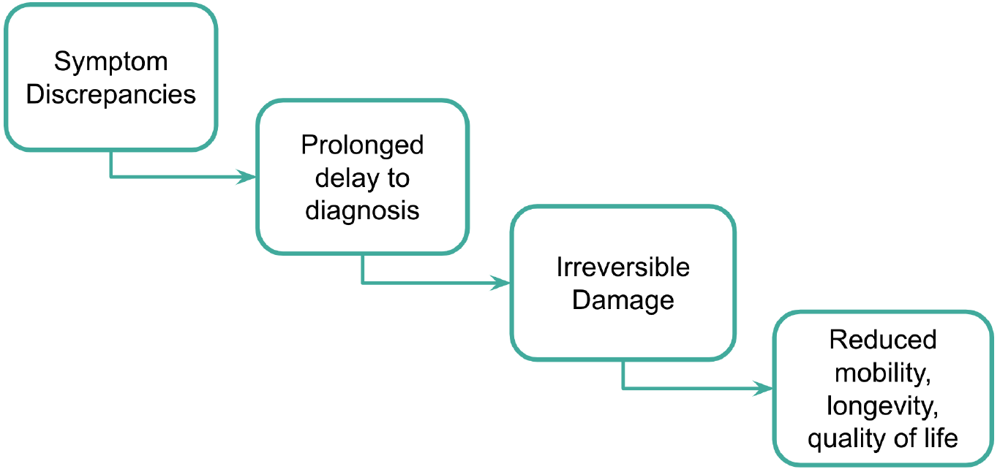
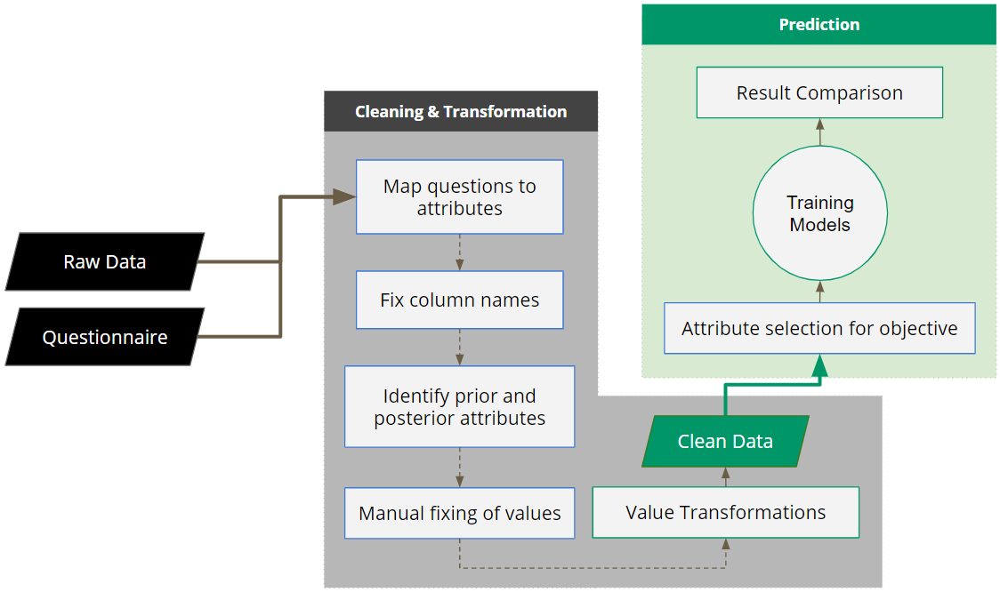
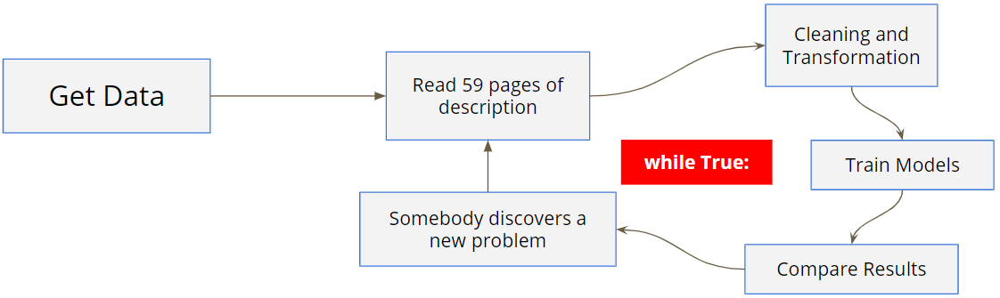
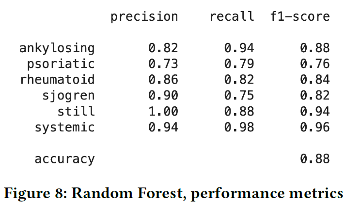
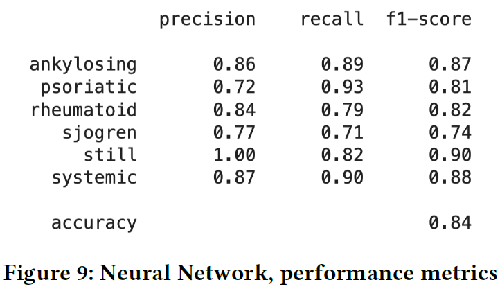
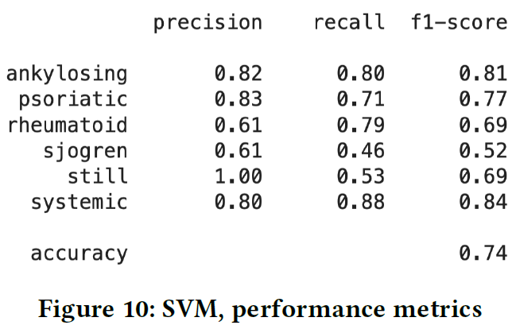
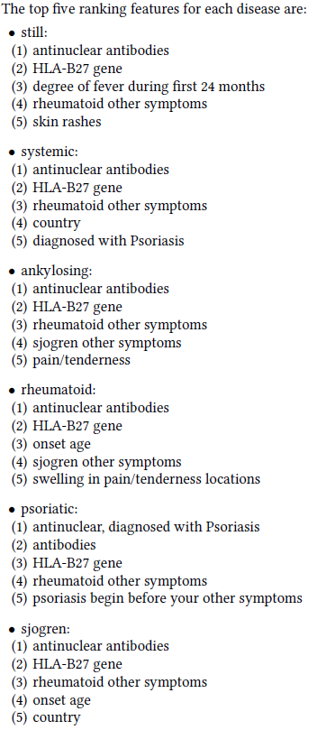

# Complete Report
[CSE_243_Project_Report](resources/CSE_243_Project_Report.pdf)
# Motivation
We would like to increase the accuracy and shorten the
time to diagnosis of sufferers with the following Autoimmune
diseases: Ankylosing Spondylitis (AS), Psoriatic
Arthritis (PsA), Systemic Lupus Erythematosus
(SLE), Sjögren’s Syndrome (SS), Adult-Onset Still’s Disease
(AOSD), and Rheumatoid Arthritis (RA). We hope
to accomplish this by identifying the common early
symptoms for each disease as reported by the patient.

Autoimmune Arthritis diseases are difficult to diagnose.
This difficulty is exacerbated by discrepancies between
the symptoms given for each disease in medical
journals and the symptoms that patients report experiencing
prior to diagnosis. These discrepancies prolong
the time to disease diagnosis. It is common for sufferers
of the six diseases in the study to go years without an accurate
diagnoses. Since these diseases are autoimmune
diseases, during this time, the body is literally attaching
itself. The more time that lapses between disease
onset and disease diagnosis, the more damage occurs.
Damage which is irreversible and which reduces the patient’s
mobility, longevity, and quality of life. Any work
in this area that either confirms early symptoms commonly
associated with one of these diseases or identifies
new ones, aides in the diagnosis process and possibly
shortens time to diagnosis resulting in better long term
prognosis.

# Final pipeline:
This is a final pipeline of our whole process. It was developed
through process iterations in our experiements.

Final process pipeline. The bluebordered
methods requires manual interventions
and optionally some automated processes.

# Data mapping & Attribute Renaming
The pivotal element of a smart mapping between the
questions and dataset attribute is the Prefixing mechanism
we employed. The prefixed we created served
several purposes:
- To denote which section, group, or question the
attribute belongs to. For example, AAD_AD prefix
denotes the group of the chosen 6 autoimmune
diseases which can develop after the first autoimmune
disease.
- Some questions has multiple choice options. Each
of the option becomes a attribute in the dataset.
So, they were prefixed with the same string. This
helps to filter out the whole question from dataset.
- Prefixes also help us to segment data. Though, we
did not conduct any experiment with segmentation
in this project, it will be helpful for future
work.
In addition to help us to build effective mapping, renaming
also helped us to create transformers easily. For
example:
**“[M_Thr_Nk_Ns_24] 34. Did you have
any of the following issues with your mouth/ throat/
neck/ nose region during the first 24 months after
initial onset? [Painful swollen and tender lymph
nodes in areas of the body not including the face
and/or neck?]”**
is an actual attribute name in the raw dataset. If we
want to refer to the column in our automated cleaning
and transformation scripts, that would be cumbersome
to work with. But our new name for the column,
**Ex5_34_body**, was easy to refer. Here Ex5 denotes section
of "Exhibit 5", 34 denotes "Question no 34", and
body denotes the option with body excluding face and
neck.

# Data Cleaning & Transformations
We call automated transformation algorithms by transformers.
Before transforming values of an attribute,
we need to make sure they are clean and consistent
enough for the transformer to work. Each transformer
can apply a set of ordered basic transformers.
For continuous values like age, we automated detection
of non-numeric values and manually fixed them
in Microsoft Excel. For categorical valueswe followed
the following steps:
1. Figure out definitions of missing values for the
attribute
2. Replace missing values with string "NA2". "NA2"
was chosen instead of "NA" as some analytic and
machine learning libraries automatically processed
"NA" as missing values. We wanted full control
on our processes.
3. Figure out unique values. This itself is two step
process. First step is automatically extract unique
string values. Then manually detect "duplicates"
and map duplicates to a single value.
4. Create a transformer to transform all the values
for the attribute.
For mixed attributes having data from both pre and
post symptoms, we needed to extract new attributes
before applying the transformations.

# Experimental pipeline
Our final process pipeline 6 emerged from experimental
pipeline in 7. We revised the cleaning and transformation
processes several times which resulted in a
sequence of revisions in and execution of other processes.

# Results

  
  
  

# Feature Importance

  

# Future Work
Possible future work includes:
1. Create survey that lends itself to analysis and
that also includes questions that will help us answer
questions raised during analysis. Identifying
patterns of symptoms over time for different diseases/
segments.
2. Segmentation Analysis
3. More experiments with models
4. Predicting a sequence of Autoimmune diseases
5. Identifying relevant symptoms